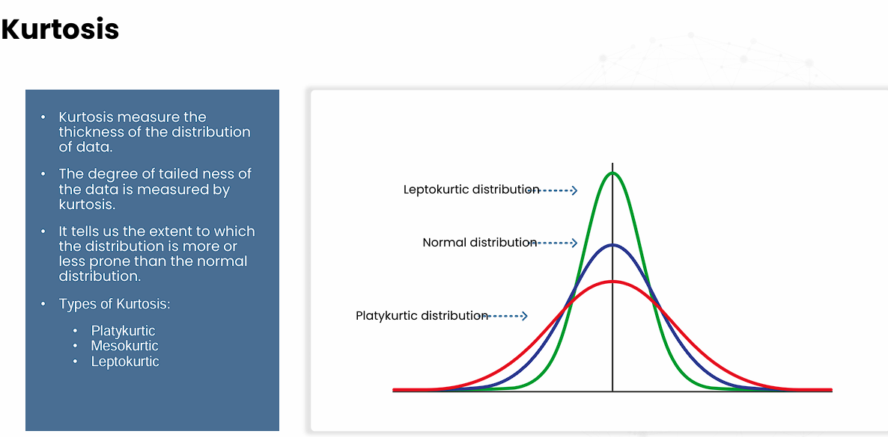

 Probability sampling
 • Every member of the population has an 
equal chance of being selected
 • Examples: – Simple random sampling– Stratified random sampling– Cluster sampling– Systematic sampling
 
 Non-probability sampling
 • Samples are selected on the basis of 
judgment or the convenience of accessing 
data
 • Largely depends on a researcher’s sample 
selection skills
 • Examples:– Convenience sampling– Purposive sampling– Voluntary  response sampling– Snowball sampling

PROBABILITY SAMPLING :

Random Sampling
 Randomly choose a member from the population
 Every member and set of member has an equal chance of being selected.

Systematic Sampling
 Similar to simple random sampling
 Put a member of the population in some order and a starting point is choose as random the every “nth” 
member is selected to be in a sample.

Stratified Sampling
 First divide the population into groups
 Then from each group we select members randomly

NON - PROBABILITY SAMPLING : 

 Convenience sampling
 • Include the respondents/member who are easy to reach for researcher.

 Purposive sampling
 • Select a sample based on the purpose of the research.
 • Researcher select the sample by using their expertise and knowledge.

 Voluntary  Response Sampling
 • Based on the ease of access.
 • Members volunteer themselves instead of researcher selecting the participants and directly contacting them.  

 Snowball Sampling 
• Recruit the participants via research participants for test or study
• Used where it’s hard to find the potential population for research

 Population Sampling
 Analysing or testing entire population is impossible and also a cost & time taking. To Save our money and time we use the subset of the entire population called sample.
 Population sampling is the process of selecting a subset of the objects that is representative of the entire population. The sample must have sufficient size of  objects to warrant statistical analysis.
 Must be perform correctly since errors can lead to inaccurate and misleading result.

  where P(x) is the probability of x successes in n trials, nCx is the number of combinations of n items taken x at a time, p is the probability of success in a single trial, and (1-p) is the probability of failure in a single trial.*

